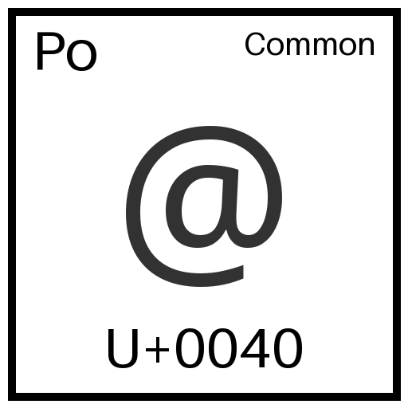

# unicode periodic table
Periodic Table style tiles for Codepoints. The idea is to use these as a visualization aid for strings, especially when it's not obvious which codepoint construct a string (such as with Arabic, Indic Scripts or Emoji). 

